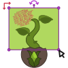

<!-- *** UPDATE THIS FOR EACH REPO *** -->
# Display Page
Repo for a simple re-usable webpage designed to display a small web element for showcase purposes.

<!-- PROJECT LOGO -->
<br />
<p align="center">
  <a href="https://github.com/Yuugen64/">
    
  </a>

  <h3 align="center">Display Page</h3>
  
  <br />
  </p>
</p>


<!-- TABLE OF CONTENTS -->
## Table of Contents

* [About the Project](#about-the-project)
  * [Built With](#built-with)
* [Getting Started](#getting-started)
  * [Prerequisites](#prerequisites)
  * [Installation](#installation)
* [Usage](#usage)
* [Contact](#contact)
* [Acknowledgements](#acknowledgements)


<!-- ABOUT THE PROJECT -->
## About The Project

<!-- [![Product Name Screen Shot][product-screenshot]](https://example.com) -->


### Created With
* Affinity Designer (Vector Graphics)


<!-- GETTING STARTED -->
## Getting Started

You should be able to simply view the github page from the link at the top. Alternatively, you may download the zip and open it locally if you feel comfortable doing so.


### Prerequisites

No prerequisites.
```sh
```

### Installation

1. Click the green download button to get the .zip!


<!-- USAGE EXAMPLES -->
## Usage
- Your viewing pleasure.

<!-- CHANGELOG -->
## Changelog:
<!-- DATES and what changed/was accomplished on that day. -->

7.11.21
- Finished the SVG icon for this repository's readme.
- [001-0.0.1]:: Basic Layout >> Added a simple pastel color palette to make alignment a little easier on the eyes. Going with a simple layout approach for now.
- [002] Icon + Layout >> Updated the readme icon and attempted a more complicated layout.

### Main Branch:
- Where the core project is located.

<!-- CONTRIBUTING -->
## Contributing

For this particular project, there have been no outside contributions. If that changes in the future I will be sure to update this section to accurately credit those authors.


<!-- CONTACT -->
## Contact

Yuugen64@protonmail.com

<!-- ***Make sure to update REPO in BOTH URLs here*** -->
Project Link: [https://github.com/Yuugen64](https://github.com/Yuugen64)


<!-- ACKNOWLEDGEMENTS -->
## Acknowledgements
* [Othneildrew](https://github.com/othneildrew/Best-README-Template/blob/master/README.md) - For providing a great template for leveling up my README!

